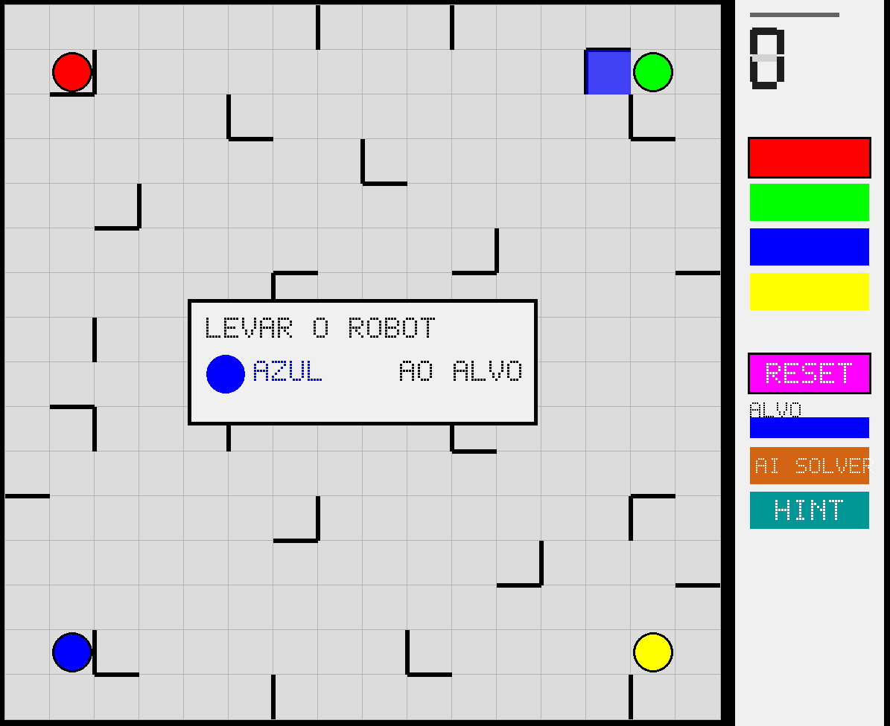
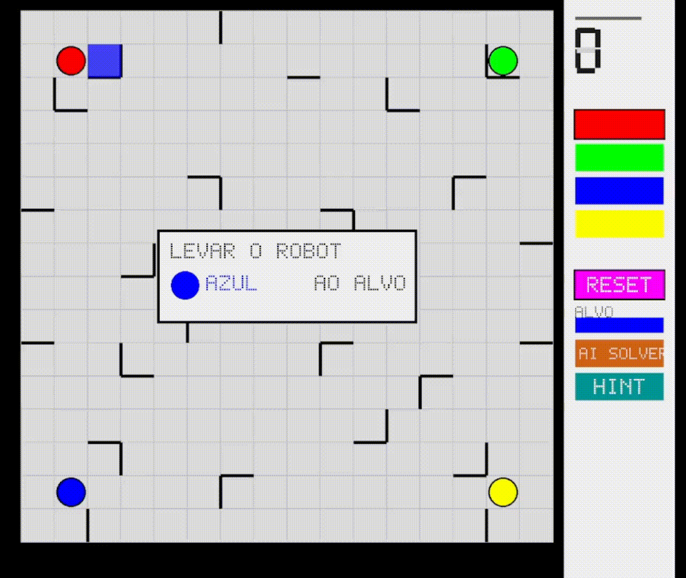

# Ricochet Robots

Ricochet Robots is a board game by Alex Randolph. The goal of the game is to place one of the robots in its corresponding target (of the same color), in the fewest steps possible. The trick is that once a robot starts moving, it won't stop until it hits a wall or another robot. The player(s) have to find the sequence of moves, using the multiple robots, to reach the goal in the fewest steps possible. This is a digital recreation of the game, in which you will be facing a bot always capable of finding the most optimal solution! 



## Installation

### Dependencies

This project depends on the SFML 3.0 library for its graphical interface. 

**Linux - Debian based distros**
```
sudo apt-get install libsfml-dev
```

**Linux - Arch based distros**
```
sudo pacman -S sfml
```

**MacOS**
```
brew install sfml
```

More detailed installation instructions can be found in SFML's official website:

https://www.sfml-dev.org/tutorials/3.1/#getting-started


**IMPORTANT:** if the version available on your package manager is below 3.0, you will have to install the library manually

From the SFML website: "Download the SDK from the download page, unpack it and copy the files to your preferred location: either a separate path in your personal folder (like /home/me/sfml), or a standard path (like /usr/local).
If you already had an older version of SFML installed, make sure that it won't conflict with the new version!"

The latest SDK can be found here:
https://www.sfml-dev.org/download/


### Building and Executing

Clone this repository (or download the zip file), and then use the provided Makefile to build the project:

```
git clone https://github.com/CamilaSilva-UP/RicochetRobotsSolver.git RicochetRobots
cd RicochetRobots
make
```

Then run the executable:

```
./Ricochet
```

## How to play

You can access the How to Play screen from the main menu of the game! But here are the general rules:
- At the start of the round, the game will tell which colored robot to get to its target
- You choose which robot to control from the menu on the right
- You can move the robot using the arrow keys. Be careful, as each move you do gets added to the move counter!
- When you reach the goal, it's the bot's turn. It will find and display the most optimal solution. If you were able to find the same solution, or one with the same amount of steps, you won the round!
- You can press the purple button on the menu to reset and reshuffle the board
- If you are stuck, or simply wish to see the optimal solution, you can press the "AI SOLVER" button:
  - If you didn't do any moves, it will display the optimal solution
  - If you already did some moves, it will display the optimal solution **from the current position**, and then display the most optimal solution from the beginning



Have fun!

------------

### Benchmarking 

The program comes with a simple benchmarking program, to test the times between a BFS implementation and a A* implementation for the AI bot. 

First, compile it using:

```
make benchmark
```
And then run it:

```
./Benchmark
```
